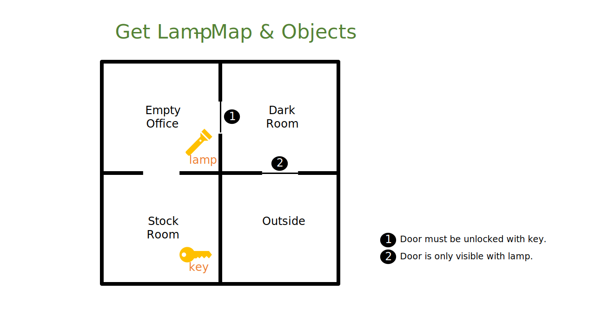

# GetLamp, the game
GetLamp is a simple text adventure with implementations in multiple programming languages.

This project started out of a desire to implement the same program in multiple programming languages of historical interest, and learning more about how programming evolved in the past 50 years.

The first meaningful program I ever wrote, over 30 years ago, was a text adventure. It seemed only fitting to use a text adventure for this multi-language experiment.

You can find a detailed explanation about the game and each implementation on my [YouTube channel](https://youtube.com/@TacianoPerez).

## Implementations

The implementations already available are programmed in:
- Applesoft BASIC
- Borland Turbo C
- 6502C Assembly for the Apple IIe
- Borland Turbo Prolog 2.0

Upcoming implementations are planned in:
- LISP
- Smalltalk
- Java 1.0

(dialects still TBD)

## Game Map

